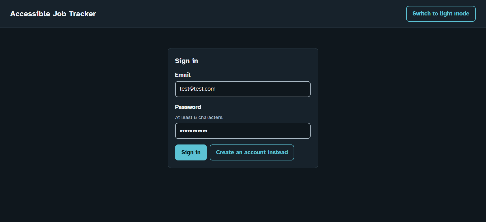
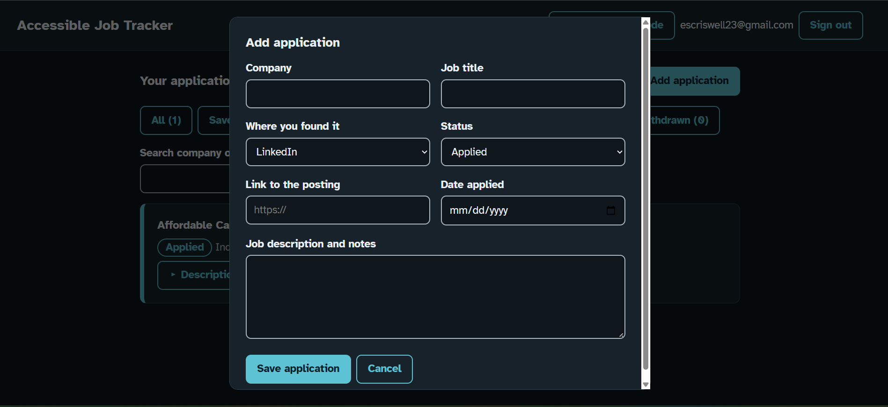
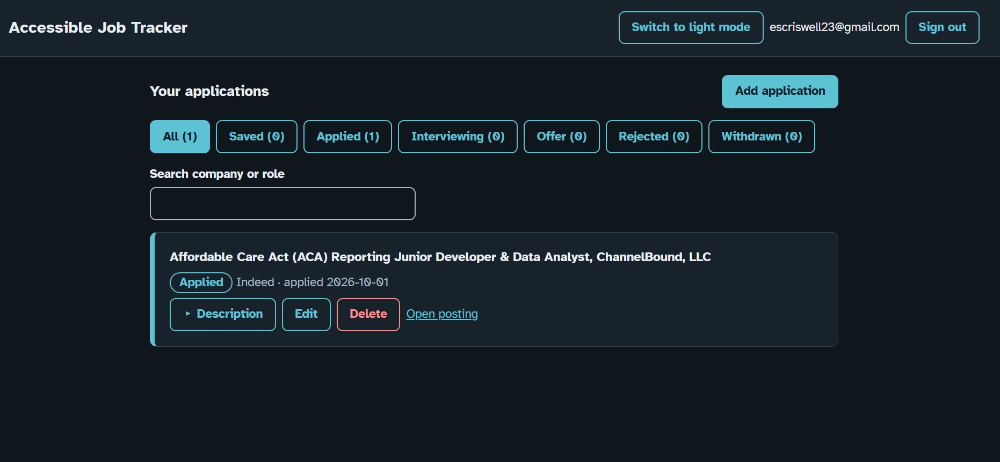
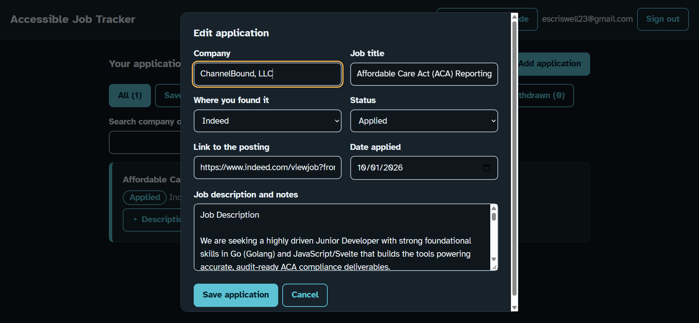
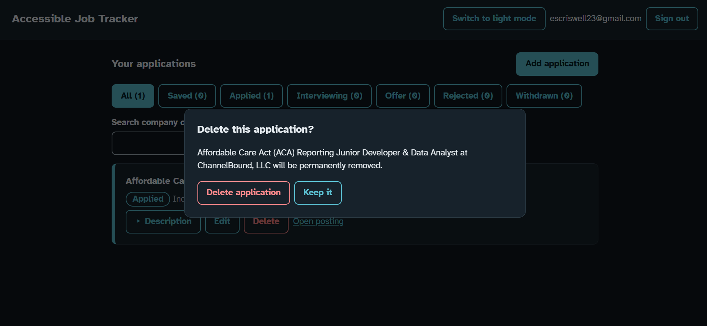
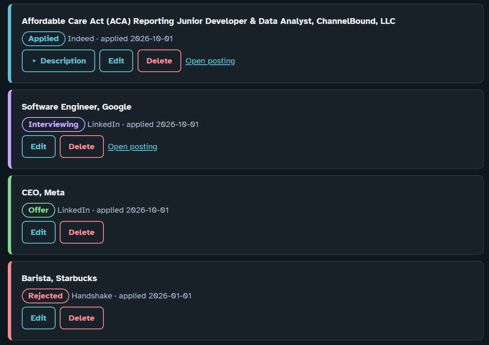
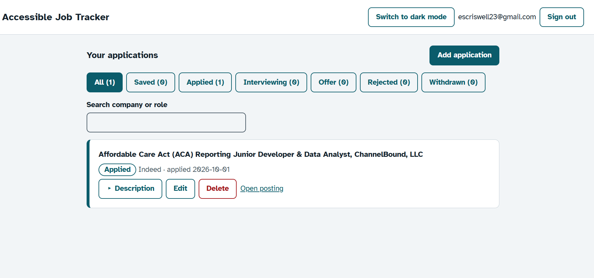

# AccessTrack - Job Tracker Application Database
 
A job application tracker with user accounts, built with [PocketBase](https://github.com/pocketbase/pocketbase) and plain HTML, CSS, and JavaScript. Log each application with the company, role, where you found it, a link to the posting, the job description, and its current status.
 
## What it does
- Sign up and sign in; each user only sees their own applications (enforced by PocketBase API rules on the server, not just in the UI)


- Create, view, edit, and delete applications






- Filter by status, search by company or role, and expand or collapse long job descriptions


- Built with accessibility in mind: skip link, labelled form fields, screen reader announcements, focus-managed dialogs, status shown in text and not by color alone, large touch targets, dark mode, and support for reduced motion



## Try it yourself (about 5 minutes)
The app runs entirely on your own computer. Nothing is uploaded anywhere, and you don't need to install anything except one small program (PocketBase). You do need an internet connection the first time, because the page loads a font and the PocketBase library from the web.
 
### 1. Download this project
On this repository's GitHub page, click **Code → Download ZIP**, then unzip it. You'll get a folder containing `pb_public` and `pb_migrations`.
 
### 2. Download PocketBase
1. Go to https://github.com/pocketbase/pocketbase/releases
2. Download the version this project was tested with, **v`<version>`**, or the newest release if you can't find it. Under **Assets**, choose the zip for your computer:
   | Your computer | File to download |
   |---|---|
   | Windows | `pocketbase_<version>_windows_amd64.zip` |
   | Mac (Apple chip: M1 or newer) | `pocketbase_<version>_darwin_arm64.zip` |
   | Mac (Intel) | `pocketbase_<version>_darwin_amd64.zip` |
   | Linux | `pocketbase_<version>_linux_amd64.zip` |
3. Unzip it. Inside is a file named `pocketbase` (`pocketbase.exe` on Windows).
4. **Move that file into the project folder from step 1**, next to the `pb_public` folder. It should look like this:
```
job-tracker/
├── pocketbase.exe      (or "pocketbase" on Mac/Linux)
├── pb_public/
└── pb_migrations/
```
 
### 3. Start the app
Open a terminal in the project folder:
- **Windows:** open the folder in File Explorer, click the address bar, type `cmd`, press Enter, then run:
```
  pocketbase.exe serve
```
- **Mac/Linux:** open Terminal, `cd` into the folder, then run:
```
  chmod +x pocketbase
  ./pocketbase serve
```
 
Leave this window open while you use the app. If your computer warns that the program is from an unknown developer:
- **Windows:** choose **More info → Run anyway**.
- **Mac:** run `xattr -d com.apple.quarantine pocketbase` and try again.
### 4. Open the app
Go to **http://127.0.0.1:8090/** in your browser.
 
1. Select **Create an account instead** and sign up with any email and a password of at least 8 characters. The email can be made up, since nothing is sent and the account only exists on your computer.
2. Add an application, then try editing it, expanding its description, filtering by status, searching, and deleting it.
PocketBase may print a link in the terminal for creating an "admin" account. You can ignore it, because the app doesn't need one. It's only for browsing the raw database.
 
### 5. Stop and clean up
- Press **Ctrl + C** in the terminal window to stop the app.
- Your test data is stored in a `pb_data` folder that PocketBase creates automatically. Delete that folder to reset everything, or delete the whole project folder when you're done.
  
## Where the code is
- `pb_public/index.html`: first half of the front end (markup and JavaScript)
- `pb_public/styles.css`: second half of the front end (the stylesheet)
- `pb_migrations/`: the database collection, fields, and API rules, created automatically the first time PocketBase starts
The API rules on the `applications` collection are what keep each user's data private:
 
- List/View/Delete: `user = @request.auth.id`
- Create: `@request.auth.id != "" && @request.body.user = @request.auth.id`
- Update: `user = @request.auth.id && @request.body.user:isset = false`

## Troubleshooting
- **Page won't load:** make sure the terminal window is still open and showing PocketBase running, and that you opened `http://127.0.0.1:8090/`. Don't open `index.html` by double-clicking it, because it has to be served by PocketBase.
- **"Port already in use":** start it on another port, for example `pocketbase.exe serve --http=127.0.0.1:8091`, then open `http://127.0.0.1:8091/`.
- **Can't see applications after adding one, or an error appears above the list:** stop the app, check that the `pb_migrations` folder is next to the executable, and start it again.

## Accessibility features included
- Skip link, landmarks, one `h1`, logical heading order
- Every input has a visible label; errors are plain-language, tied to the field via `aria-invalid`, and announced with `role="alert"`
- Status changes (added, updated, deleted, filter changes) are announced through a polite live region
- Native `<dialog>` for add/edit/delete: focus is trapped, Escape closes, focus returns to the button you came from
- Status is shown as text, never by color alone; filter buttons use `aria-pressed`
- Icon-free buttons with unique accessible names
- Links that open a new tab say so to screen readers
- 44px minimum touch targets, strong visible focus ring, Atkinson Hyperlegible font
- Light/dark theme that follows the OS setting and can be toggled, `prefers-reduced-motion` and forced-colors support, and usable when zoomed to 200%
